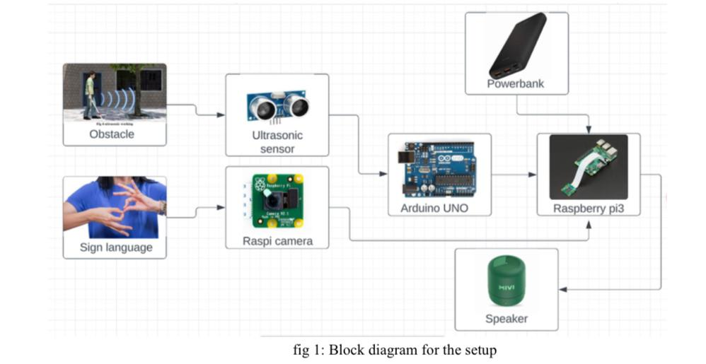
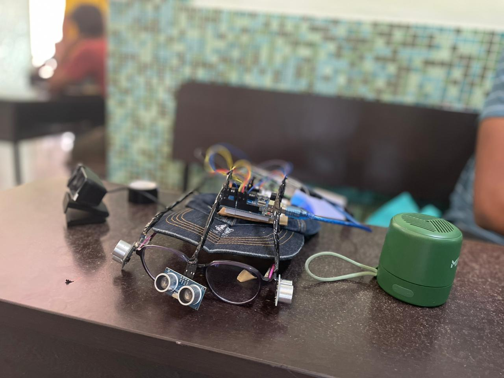

# Smart Glasses for the Blind and Poor

A low-cost assistive device designed to empower visually and hearing-impaired individuals by combining obstacle detection with sign language recognition using embedded systems and machine learning.

---

## Overview

This project presents an innovative pair of smart glasses that serve two core functionalities:
- **Obstacle Detection for the Blind** using ultrasonic sensors and audio feedback.
- **Sign Language Recognition for the Deaf and Mute** using a Raspberry Pi, camera module, and a trained machine learning model.

The goal is to provide an affordable and accessible solution that bridges the gap in assistive technologies for underprivileged individuals.

---

## Features

- **Real-time Obstacle Detection** using an HC-SR04 ultrasonic sensor.
- **Machine Learning-based Sign Language Detection** using LSTM & OpenCV.
- **Audio Feedback System** for alerts and recognition output via portable speaker.
- **Custom dataset of hand gestures** collected and preprocessed using MediaPipe. Data was labeled, normalized, and fed into an LSTM model

---

## System Architecture



**Core Components:**
- Arduino UNO (for obstacle detection)
- Raspberry Pi 3 (for ML inference and camera input)
- HC-SR04 Ultrasonic Sensor
- Raspberry Pi Camera Module
- Bluetooth/USB Speaker
- Powerbank (as power source)

---

## Demo


- Uses MediaPipe and Keras for hand gesture detection.
- Supports custom-trained gestures for sign language classification.
- Outputs recognized signs as audio commands.

---

## How It Works



### 1. Obstacle Detection
- The ultrasonic sensor mounted on the glasses continuously scans for nearby obstacles.
- The Arduino processes distance data and sends alerts to the speaker if the user is in danger.

### 2. Sign Language Detection
- The Pi camera captures hand gestures in real-time.
- A trained LSTM model predicts the gesture class.
- The system converts the gesture into text and then speech.

---


## Getting Started

### Hardware Setup
1. Connect the ultrasonic sensor to the Arduino.
2. Interface the Arduino with the Raspberry Pi via serial.
3. Attach the Pi camera and speaker to the Raspberry Pi.
4. Mount the system on a cap or glasses frame.

### Software Setup

   ```bash
   1. git clone https://github.com/your-username/Smart-Glasses.git

   2. train the hand gesture model on your dataset

   3. python app.py

